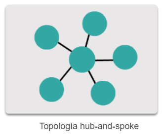
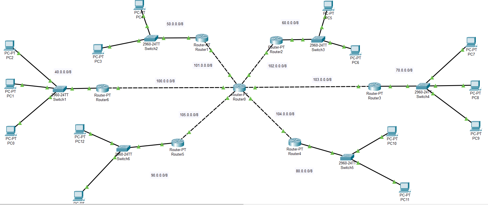
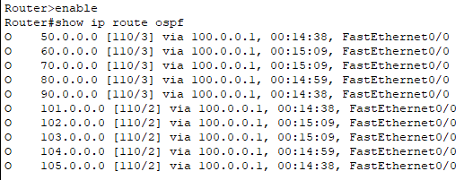

# REDES2_2S2020_P1_GRUPO10
Red de un país con 3 ISP interconectados con enrutamientos estático, OSPF, RIP y BGP. Modelo creado en Cisco Packet Tracer

## Topología Hub and Spoke



Para dicha topología se utilizó **7 Router** y se agregaron **14 host** distribuidos entre los 6 Router de los extremos.



### Enrutamiento

Se utilizó el protocolo de enrutamiento dinámico **OSPF** el cual se configura de la siguiente manera:

- En cada router se indica las redes que están **conectadas directamente** al mismo (Direccion IP y Wilcard de la red)

> El siguiente ejemplo muestra como se configuró OSPF en el router central

```
enable
configure terminal

router ospf 1
network 100.0.0.0 0.255.255.255 area 1
network 101.0.0.0 0.255.255.255 area 1
network 102.0.0.0 0.255.255.255 area 1
network 103.0.0.0 0.255.255.255 area 1
network 104.0.0.0 0.255.255.255 area 1
network 105.0.0.0 0.255.255.255 area 1
```

Se repite lo anterior en cada router y ya estará configurado el enrutamiento dinámico, por lo que podrá hacer ping desde y hace cualquier host.

### Verificar la tabla de rutas

Con el comando `show ip route ospf` se puede mostrar la tabla de rutas para ospf:

Se ejecutó el comando en el **Router6** y se muestra lo siguiente:



En dicho router solo se indicó las redes conectadas al él mismo, pero como en todos los routers se hace los mismo, se comparten entre ellos la tabla de rutas del vecino.